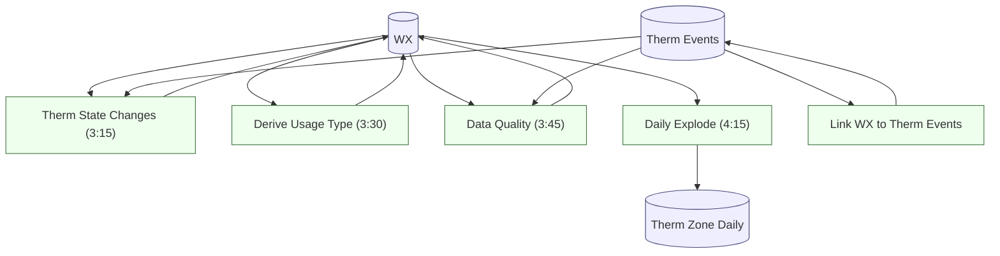

# Thermostat Automation Pipeline DAG

This document describes the Airtable automation pipeline that derives thermostat daily artifacts in the **Maintenance/Services** base (appoTbBi5JDuMvJ9D).

## Scope

Pipelines covered:
- Thermostat daily derivations written into **WX** (daily fact table)
- Therm Zone Daily derived table upsert
- Event-to-day linkage for Thermostat Events

Out of scope (documented elsewhere):
- Weather ingestion (Visual Crossing)
- Open-Meteo enrichment
- Home Assistant rollups (external scripts)
- Presentation-only Slack notifications (unless they gate or mutate contracts)

---

## DAG (Mermaid)

Execution order and dependencies
Scheduled runs (local EST display):

03:15 — Therm State Changes

Reads: Thermostat Events (Timestamp/New Setpoint/Zone)

Reads: WX (datetime, om_temp, per-zone KWH Auto)

Writes: Therm SP derived JSON fields into WX

03:30 — Derive Usage Type

Reads: WX Therm SP Timeline (Derived) (authoritative ON/OFF)

Reads: sum of * KWH (Auto) for “Enabled, No Heat Needed”

Writes: WX Usage Type

03:45 — Data Quality

Active-only policy: required zones are those with events that day (minus excluded zones)

Reads: Thermostat Events by day

Reads: WX per-zone KWH Auto

Writes: WX Therm DQ Status/Score/Notes/etc.

04:15 — Daily explode script

Reads: WX thermostat derived JSONs + per-zone KWH Auto + Usage Type + Therm DQ Status

Upserts: Therm Zone Daily (1 row per Zone per local day)

Event-driven:

Link WX to Therm Events

Trigger: on Thermostat Events record creation

Action: update the same Thermostat Event record, setting the WX link field

Contract-affecting vs presentation-only
Contract-affecting automations:

Therm State Changes (3:15am)

Derive Usage Type (3:30am)

Data Quality (3:45am)

Daily explode script (4:15am)

Link WX to Therm Events

Presentation-only (not shown in DAG unless they gate data writes):

DQ Warn (Slack)

Set Point to Off (Slack)

### Identity field alignment

All thermostat-derived automations now identify daily WX records using `WX.datetime`,
which is treated as the canonical local-day identity field (date-only).

Remaining variation:
- Thermostat Events are still filtered using `Thermostat Events.Date`

This is an intentional boundary between event-day identity and daily fact identity.

On DST transition days, verify targetDate in logs/notes for Usage Type and Data Quality.”

“If needed, rerun with explicit targetDate input variable.”
---

## Operational runbook

For execution details, mutable-truth behavior, drift detection, and reconciliation procedures, see:

- [`RUNBOOK_thermostat_kwh_rollup.md`](RUNBOOK_thermostat_kwh_rollup.md)
