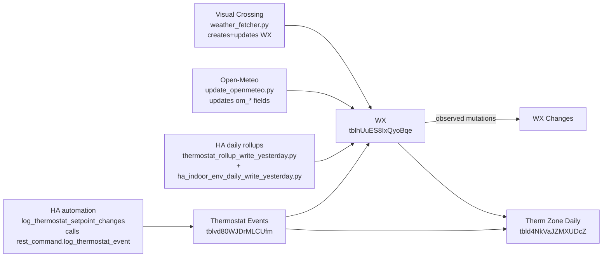

# Lineage Index — Airtable Base appoTbBi5JDuMvJ9D

This folder documents the **ingestion + enrichment lineage** for the core tables in the
Maintenance/Services Airtable base (`appoTbBi5JDuMvJ9D`). The goal is to make data movement
auditable: *who can write what, when, and under what invariants*.

## Canonical lineage docs (table-by-table)

- **WX** (`tblhUuES8IxQyoBqe`) — `docs/lineage/TABLE_wx.md`  
  Daily fact table (1 row per local day). Convergence point for weather, HA rollups, and automations.

- **Thermostat Events** (`tblvd80WJDrMLCUfm`) — `docs/lineage/TABLE_thermostat-events.md`  
  Near–real-time append-only event log of **effective setpoint changes** (OFF mapped to 0).

- **Therm Zone Daily** (`tbld4NkVaJZMXUDcZ`) — `docs/lineage/TABLE_therm-zone-daily.md`  
  Derived-only per-(Zone × Local Day) facts, created via deterministic upsert.

- **WX Changes** — `docs/lineage/TABLE_wx-changes.md`  
  Append-only observability table recording meaningful WX mutations (audit/trust surface).

## Pipeline DAG (conceptual)

## Writer contracts (high-level)

### WX (tblhUuES8IxQyoBqe)
- **Row creator:** Visual Crossing ingestion **only**.
- **Other writers:** Open-Meteo (om_* fields), Home Assistant rollups (HA-owned fields), Airtable automations (derived fields), humans (explicit manual fields only).

### Thermostat Events (tblvd80WJDrMLCUfm)
- **Row creator:** Home Assistant automation **`log_thermostat_setpoint_changes`** (real time) via `rest_command.log_thermostat_event`.
- **Write mode:** append-only (no updates/deletes).

### Therm Zone Daily (tbld4NkVaJZMXUDcZ)
- **Sole writer:** Airtable Automation **therm-zone-daily**.
- **Write mode:** deterministic upsert keyed by (Zone × Local Day).

### WX Changes
- **Row creator:** Airtable automations that observe WX mutations (append-only audit log).

## Global invariants (must remain true)

1. **Field ownership is the collision-avoidance mechanism.** Producers must not write outside their owned fields.
2. **No “clock-time correctness.”** Downstream stages should gate on *data evidence* (readiness signals), not just schedule time.
3. **Append-only logs stay immutable.** Thermostat Events and WX Changes are not edited or deleted.
4. **Derived tables are reproducible.** Therm Zone Daily can be safely recomputed from upstream evidence.

## Naming conventions

- **Lineage docs** live in `docs/lineage/` and are named:
  - `TABLE_<table-slug>.md` (kebab-case slugs)
  - `LINEAGE_INDEX.md` (this file)
- Use the Airtable **table id** in the doc header for unambiguous mapping.
- When referencing a producer, use the literal actor name:
  - `weather_fetcher.py`, `update_openmeteo.py`, HA automation `log_thermostat_setpoint_changes`, etc.

## Where to look next

- Automation specifics (triggers, schedules, scripts): `docs/automations/`
- Schema contracts (field definitions / allowed semantics): `docs/schema/`
